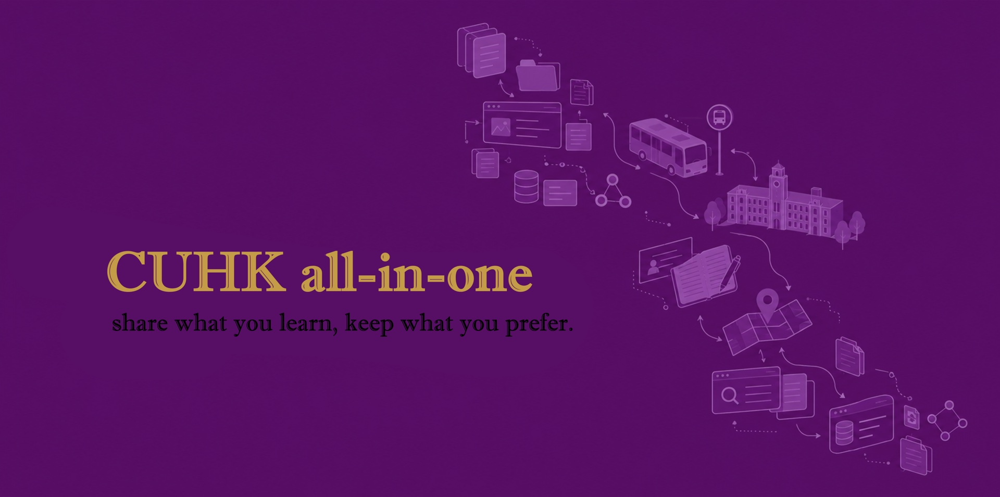
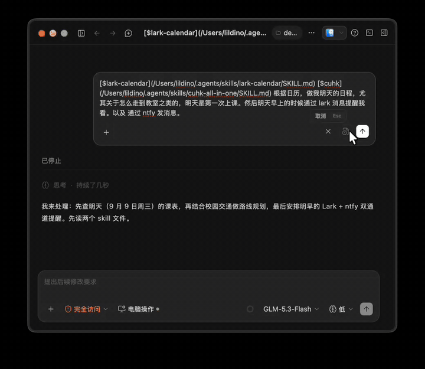

[English](README.en.md) | 简体中文

[](https://www.skills.sh/?q=cuhk)



把中大装进一个任何人（和任何 AI 助手）都能查阅的知识库：校园巴士怎么坐、某栋楼从哪个站下、这门课在哪上、官方信息去哪查。

## 为什么做这个

我曾经在 ZJU 饱受信息分散的折磨——答案散落在群聊、攻略帖和口口相传里，每个人都在重复踩同样的坑，而踩过的坑又随着聊天记录一起沉底。来到 CUHK 之后，我想为此做一些什么。

所以我们建立了这个项目：一个**足够尊重个人意愿**的信息共享平台，和一种**足够现代**的协作模式——每一位愿意参与知识和经验共享的 CUHKer，都可以在这里贡献自己的力量，同时得到他人的帮助；如果你有些小经验暂时只想自己用，它同样支持你把它们保留在本地、不公开。分享是善意，保留是权利。

## 它是什么

这不只是给人看的 wiki，更是一个 **AI agent 可以直接使用的技能包（skill）**。clone 之后你的 AI 助手即可回答校园问题。所有知识都带来源、可验证、可判定过期：

| 目录 | 内容 |
|---|---|
| `knowledge/common/bus/` | 校园交通全量数据：校巴 / 上下课班车 / 收费小巴的线路、班次、站序与路线规划 |
| `knowledge/common/place/` | 地点到达指南：某栋楼坐什么车、在哪下、下车怎么走（含实景图） |
| `knowledge/common/search-playbook.md` | **信息收集方法论**：官方信息去哪查（CUSIS、Blackboard）、公告怎么读、社区攻略怎么抓回来并核验 |
| `knowledge/msc-ai/` | 学科知识：课程文件、项目信息、学科级信息源与学科级搜索方法（其他学科照此建目录） |
| `personal/` → `~/.cuhk/personal/` | **你的私有层**（在你的用户目录、不在仓库里，安装与更新永不触碰）：不想公开的小经验放这里，同名文件永远以它为准 |

所以它**既授人以鱼，也授人以渔**：`knowledge/` 里不只有答案（时刻表、到达方案这些"鱼"），还把 **agent 收集信息的方法本身当作知识存了下来**——去哪查、怎么读、怎么抓、抓回来怎么核验，都在 search playbook 里。答案会过期，方法会沉淀；agent 每次用方法查到新知识，都按规范写回知识库，于是这个库会自己生长。

## Demo




## 怎么用

```bash
npx skills add NiJingzhe/cuhk-all-in-one
```

[skills](https://github.com/vercel-labs/skills) 会把技能装进各 AI 助手的 skills 目录并自动适配（ZCode / Claude Code / Codex 等；加 `-g` 装到全局）。首次会话，agent 会按 [`SKILL.md`](SKILL.md) 把安装目录**原地 git 化**并同步上游——所以 fork、开 PR、日常更新（每次会话自动 git 同步）与 git clone 直装完全一致。想直接 clone 也行：`npx cuhk-all-in-one`（npm 薄安装器，内部就是 git clone）。agent 会自动加载知识并回答问题；首次使用会询问你的专业，只加载你需要的学科。

**你的私有层**在 `~/.cuhk/personal/`（Windows：`%USERPROFILE%\.cuhk\personal`）——在你的用户目录里、不在仓库中，任何安装与更新都不会碰它。**不要用 `npx skills update` 更新本技能**：它整目录重刷，会清掉 `.git` 和未分享的改动；更新由 agent 在会话开始时自动 git 同步。

**环境要求**：日常问答与知识同步只需 git + AI 助手。但"授人以渔"的部分——比如抓取小红书攻略、操作需要登录的站点——需要 agent 能**操控浏览器**：推荐 [ego lite](https://github.com/citrolabs/ego-lite)（[官网](https://lite.ego.app/)，ego-browser），任何支持 browser-use 的浏览器方案均可。没有浏览器也不影响已 bake 的知识问答与官方 URL 直查。

## 参与进来

两种方式，都值得尊重：

- **分享** 🌱 — **全自动**：会话结束前你只需说一声"愿意分享"，agent 会按 [`SYNC.md`](SYNC.md) 自动开分支、分组提交、开 PR——**本地和 `personal/` 永远优先，只有你明确同意才会产生 PR**，否则一切留在你的机器上。分享的新经验会按 [`knowledge/FORMAT.md`](knowledge/FORMAT.md) 规范书写（带来源、可验证、可判定过期），PR 会由每日自动任务与维护者按 [`REVIEW.md`](REVIEW.md) 审核（格式、来源、知识层面的冲突裁决）。
- **保留** 🔒 — 不想公开的部分放进 `personal/`，永远只属于你。

- **成为维护者** 🛠️ — PR 的审核与知识裁决是中心化的瓶颈，欢迎分担。审核工具是独立的 [cuhk-reviewer](https://github.com/NiJingzhe/cuhk-reviewer) skill（双仓库分工：本仓库只管**用**，那边只管**审**）。四步入门：
  1. `npx github:NiJingzhe/cuhk-reviewer` 装上审核 skill；
  2. 先提交至少一次合格贡献——走完一遍完整的分享→PR→合并流程；
  3. 开 issue 申请你想负责的范围（如 `bus/`、`msc-ai/`），附上你的示范 PR；
  4. 批准后你会进 `.github/CODEOWNERS`，此后按 [`REVIEW.md`](REVIEW.md) 的裁决层级参与审核。
  职责细节见 [`REVIEW.md`](REVIEW.md) 的"维护者模式"。

> 一个人的攻略会沉底，一群人的攻略会生长。欢迎你的第一个 PR。
