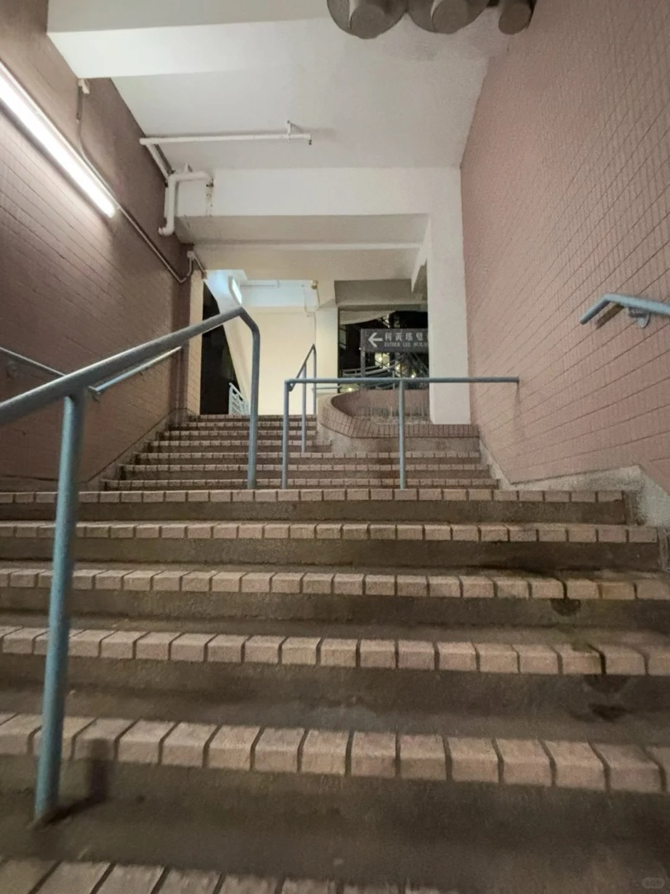
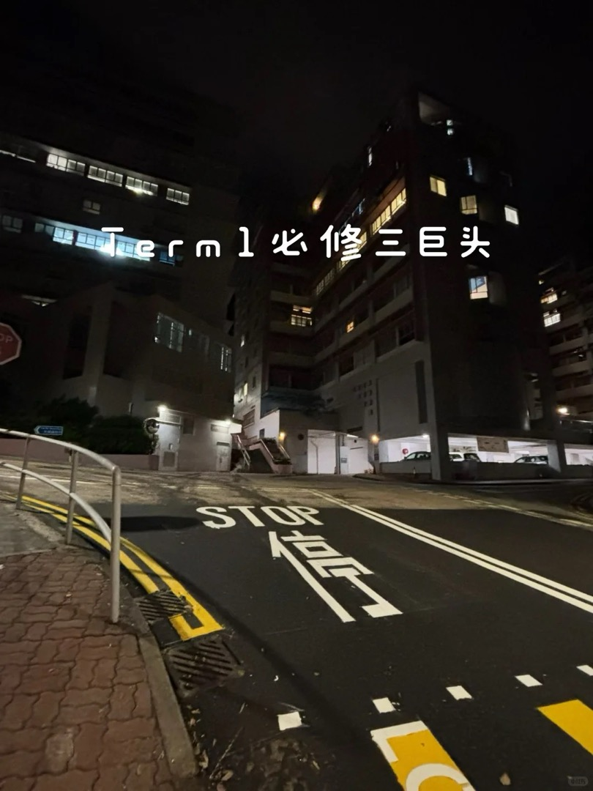

# 利黄瑶璧楼（Esther Lee Building, ELB）

## 地点识别

| 名称 | 说明 |
|---|---|
| 利黃瑤璧樓 / Esther Lee Building | 官方名，课表缩写 **ELB**（社区也写"利黄瑶碧楼"——璧/碧混用常见，指同一栋） |
| LT1 | 楼内演讲厅 |

位置：主校园低处、靠近大学站一侧（崇基体育场上方沿路一带），**步行可达，不必坐校巴**（评论区作者原话：在山下不用坐校车）。教育学院多门课在此，MScAI 5702（T1 周四晚）在此上课。

## 到达方式（从大学站步行）

1. 大学站 A 口出，进入学校。
2. 看到**体育场**（崇基的运动场），沿体育场**爬坡**。
3. 遇岔路口按指示牌转向利黄瑶璧楼方向（同一条路串联许让成楼、王福元楼、信和楼、陈国本楼、何添楼——教育学的上课楼群）。
   
   

- 全程上坡步行，参考用时 ⚠️经验推断：约 10–15 分钟。晚间下课返程顺坡下行回大学站即可。
- ⚠️ 校巴无"利黄瑶璧楼"站——想省力可坐 [[../bus/routes-shuttle#1 — Main（主校园环回）]] 到 Sir Run Run Shaw Hall / Univ. Admin. Bldg. 后折返下坡（反向走），或直接走路上山。

## 提醒

- ⚠️ 晚课后（22:00）校巴 N 线仍在运行（[[../bus/routes-shuttle#N — Night（夜间环回）]]），从 S.H. Ho College 站可下山回大学站。
- 该楼群攻略目前主要来自教育学院学生的笔记，工程向学生的实测还少；走一次后欢迎回写更正。
