# 何善衡工程学大楼（Ho Sin-Hang Engineering Building）

## 地点识别

| 名称 | 说明 |
|---|---|
| 何善衡工程學大樓 / Ho Sin-Hang Engineering Building | 官方名，缩写 **HSHB**，社区也写 **SHB** |
| **T.Y. Wong Hall（王统元堂）** | ⚠️ 课表上如果写这个，就是本楼**五楼**的讲堂——不要找别的楼 |
| 蒙民伟工程學大樓 (William M.W. Mong Eng Bldg.) | 相邻的另一栋楼，**不是**同一个地方，但内部连通（见方案 C/D） |

位置：主校园轴带北侧、蒙民伟工程大楼旁。工程学院办公室及多数 ECE/CS 课程在此。

## 到达方式总表（从大学站出发）

| 方案 | 坐什么 | 在哪下 | 步行 | 全程约 |
|---|---|---|---|---|
| **A. 校巴 1 号线（推荐）** | [[../bus/routes-shuttle#1 — Main（主校园环回）]] | Sir Run Run Shaw Hall 站（俗称"科学楼站"） | 约 4 分钟，见分步① | 10 分钟内 |
| B. 校巴 2 号线（特定时段） | [[../bus/routes-shuttle#2 — NA / UC（新亚/联合）]]：仅 ：45 发车班停邵逸夫堂 | Sir Run Run Shaw Hall 站（与方案 A 同一位置） | 同方案 A | 10 分钟内 |
| C. 校巴 2 号线 → 蒙民伟楼电梯 | 2 号线任意班（始发站前广场） | Univ. Admin. Bldg. 站 | 约 5 分钟 + 电梯至 9/F 过天桥 | 15–18 分钟 |
| D. 全程步行（不想等车） | 不坐车：A 口（罗湖/落马洲方向可 D 口）出站 | — | 16–18 分钟，全程电梯+平路 | 16–18 分钟 |

> 来源：小红书攻略（见文末），班次已与 2026-09-07 官方数据核验。选方案：赶时间选 A（班次密，:10/:25/:40/:55）；拖大件行李选 D（校内无台阶段）；1 号线未到/满员时 B/C 备选。

## 方案 A：1 号线直达（分步）

1. 大学站 **A 口**出站进校园，向右手边看，路边有遮阳棚的校巴站即 1 号线乘车站（[[../bus/routes-shuttle#1 — Main（主校园环回）]]：:10/:25/:40/:55 发车）。
   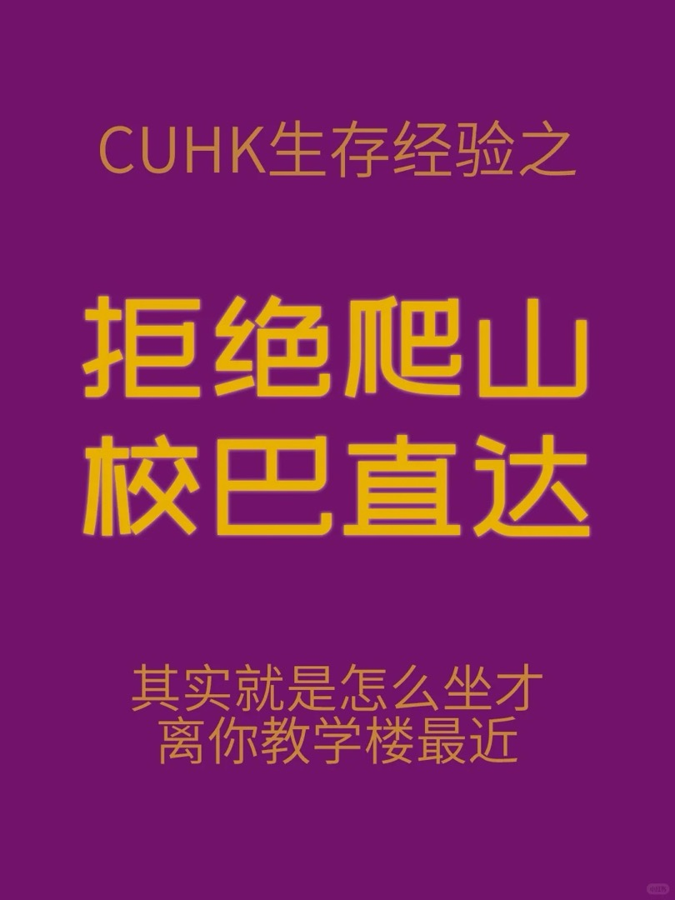
2. 坐约 5 分钟，看到车窗外大台阶广场（下图）就是 **Sir Run Run Shaw Hall 站**，下车。⚠️ 官方站名叫邵逸夫堂，攻略里常俗称"科学楼站"，因为 Science Centre 与邵逸夫堂相邻，**是同一个下车站**。
   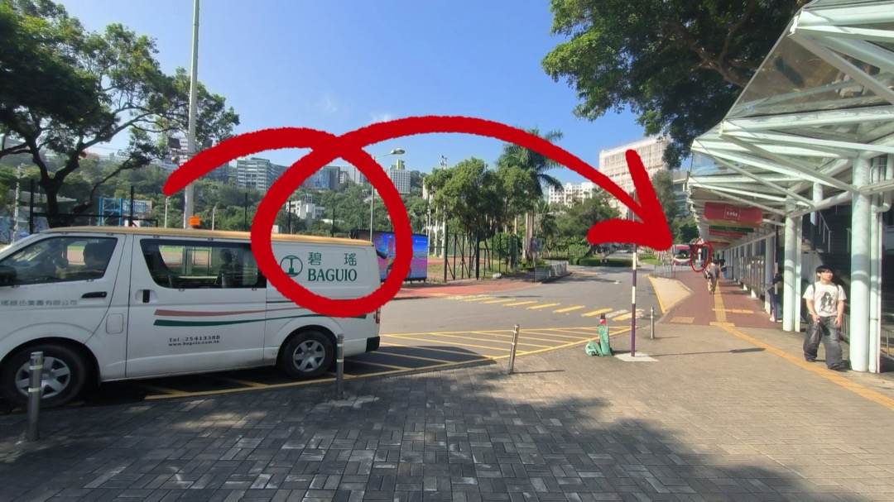
3. 下车后沿车行方向直走，到下图的大楼梯下行，**下楼梯后左拐**。
   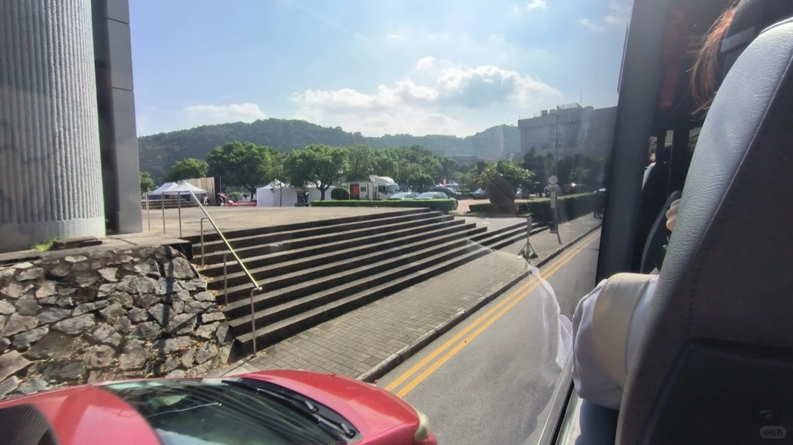
4. 左拐后留意**右手边**，从这里下去。
   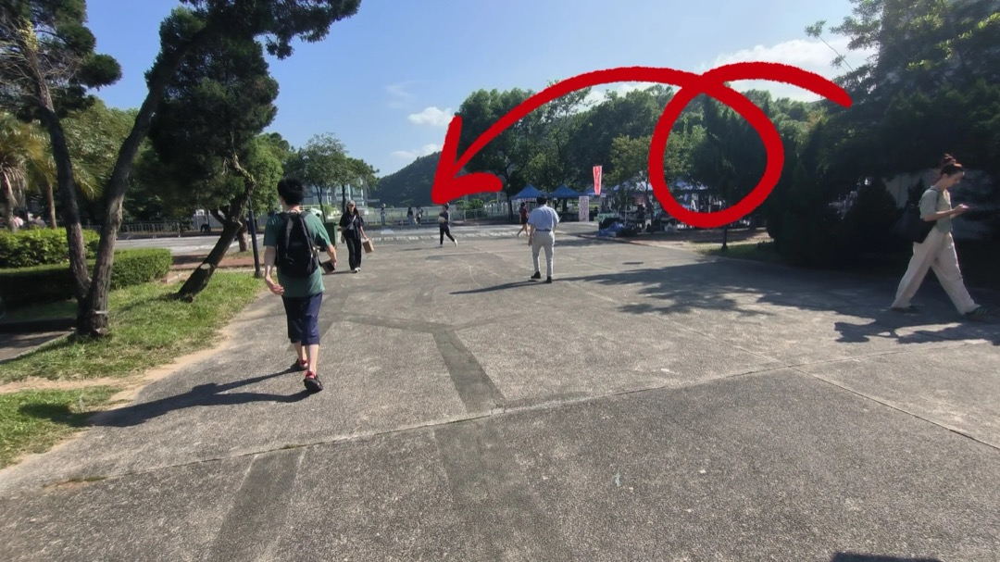
5. 沿下图道路一直直走到头，就是 **T.Y. Wong Hall（王统元堂）所在的 5/F 层**；大厅升降梯可达 HSHB 其他楼层。
   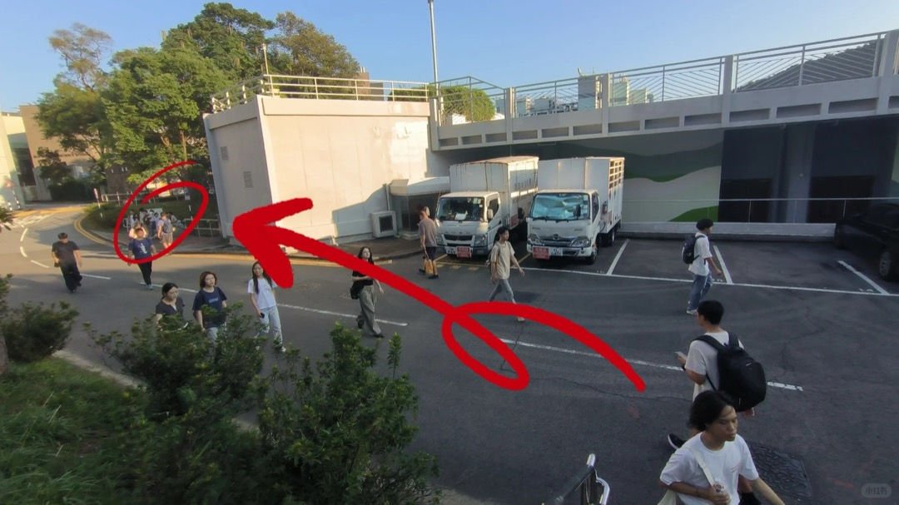

## 方案 C：2 号线 → 蒙民伟楼电梯（雨天/大件行李友好）

1. A 口出来步行到**站前广场（Station Piazza）**的 2 号线站牌乘车（2 号线始发站，[[../bus/routes-shuttle#2 — NA / UC（新亚/联合）]]）。
2. **Univ. Admin. Bldg.（大学行政楼）站**下车（坐左侧看楼），沿车行方向（下山路）走到路口右转，进门即蒙民伟工程大楼 **4/F**。
3. 该层有**快速升降梯，只停 G/4/9 楼**（Express Lifts to G/F, 4/F & 9/F only），坐到 **9/F**。
   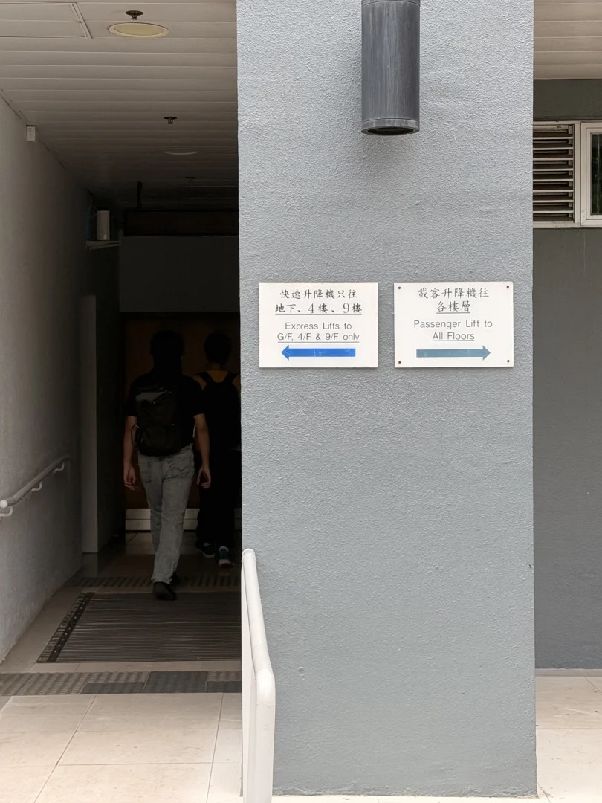
   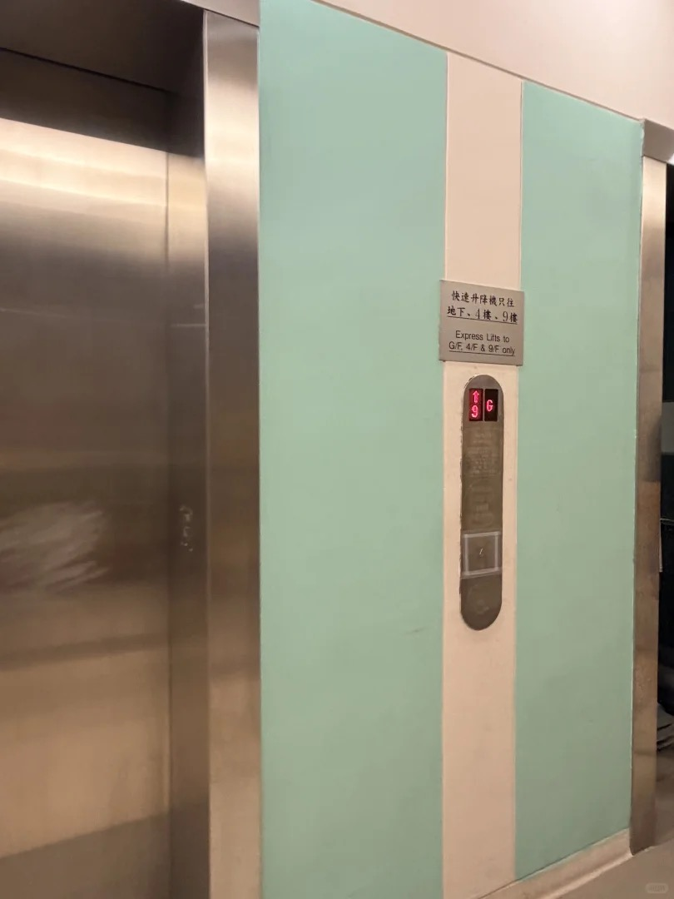
4. 9/F 出电梯走几步**往左**过天桥，对面就是何善衡工程学大楼 5/F 层——过去第一眼看到王统元堂，没走错。
   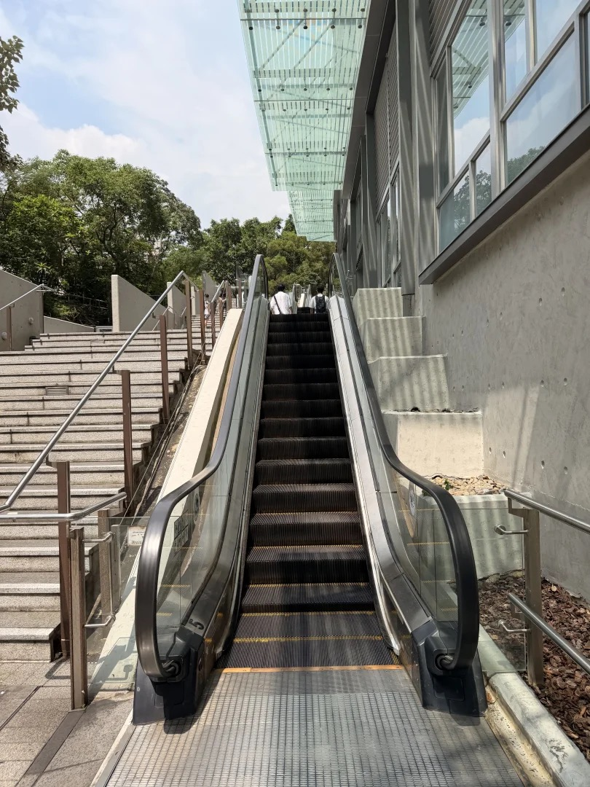

## 方案 D：全程步行（约 16–18 分钟，2026-09 实测）

要点：**几乎不爬山**，全程扶梯/电梯+平路。罗湖/落马洲方向来的同学（住沙田/大围/火炭）直接 **D 口**出，出口就是康本国际学术园，更近。

1. A 口出来**右转直走**到康本国际学术园（Y.I.A.P.），从旁边扶手电梯一路上行到顶。
   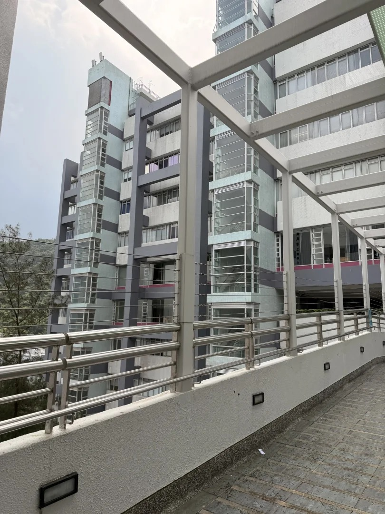
   整条步行路线的权威图解见社区捷径网站 **cuhk-shortcut-finder.lovable.app**（路线 1 · 经康本学园）：
   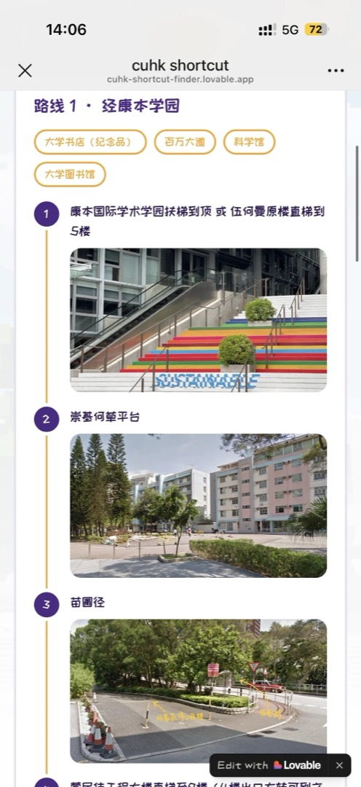
2. 扶梯到顶后往前走几步，遇**上下两条道时走下面这条（苗圃径）**。
   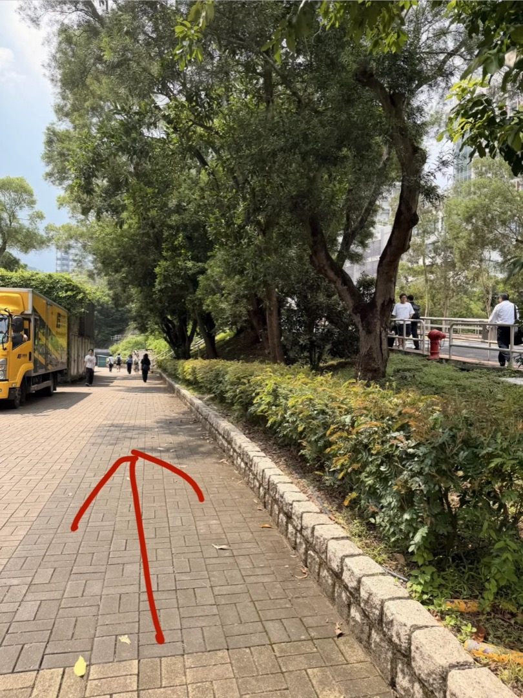
3. 沿苗圃径直行（两侧为苗圃平房），谷歌地图路线参考下图。
   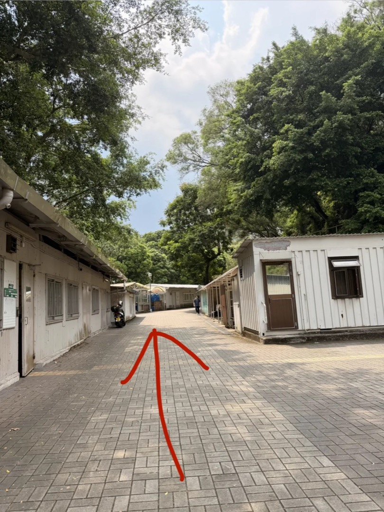
   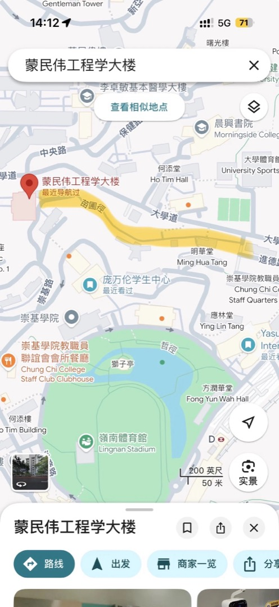
4. 走到头即**蒙民伟工程大楼电梯入口**，之后与方案 C 第 3–4 步相同：快速电梯到 9/F → 左转天桥 → 何善衡 5/F。

## 常见迷路点与提醒

- ⚠️ 从**邵逸夫堂方向**想步行去何善衡楼容易迷路（社区有专门问路的帖子）——不熟就走方案 A 的下车步骤反向操作，或干脆坐车。
- ⚠️ 2024 年笔记提醒"整点发出的 1A 会绕宿舍圈多约 2 分钟"——现行官方 1 号线为单一环回线（每班都经 S.H. Ho College 后回大学站），此差异是否仍存在待实测；赶时间按提前一班车规划。
- 何善衡楼与蒙民伟楼**是两栋楼**：找"何善衡"却走进"蒙民伟"大堂时，找快速电梯上 9/F 过天桥即可，不用出楼绕山。

## 来源与可信度

| 来源 | 日期 | 贡献 | 核验状态 |
|---|---|---|---|
| 小红书 @咖啡的刺客《校巴直达教学楼02》 | 2024-09-11 | 方案 A 全步骤+图、方案 B 时机 | 班次已按 2026-09-07 官方数据调和（1A 已更名 1） |
| 小红书 @咖啡的刺客《校巴直达教学楼01》 | 2024-09-10 | 方案 C（行政楼下+蒙民伟电梯 G/4/9） | 站点与官方 2 号线站序一致 |
| 小红书 @maritimeday《A口步行攻略》 | 2026-09 实测（2 小时前还在编辑） | 方案 D 全程+D 口捷径+shortcut 网站 | 步行用时为作者实测，非官方 |
| 小红书《何善衡天桥怎么走》问路帖 | 2024-03 | 证明邵逸夫堂侧天桥是常见迷路点 | 仅作迷路点佐证 |
