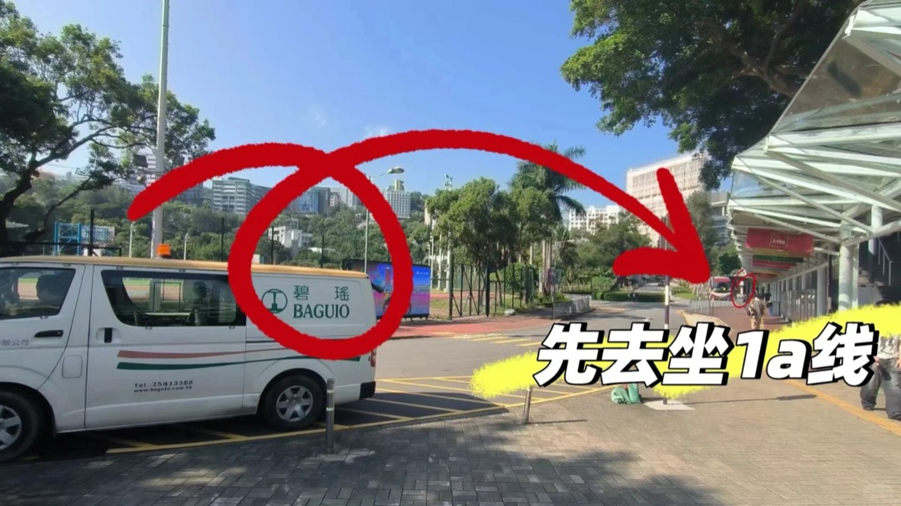
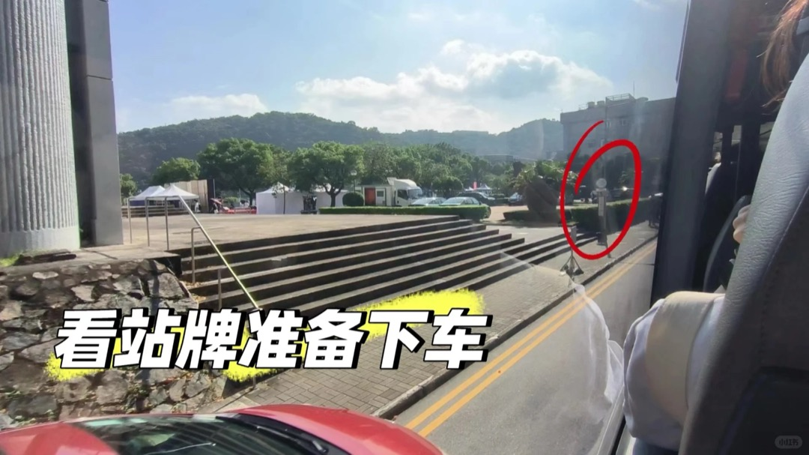
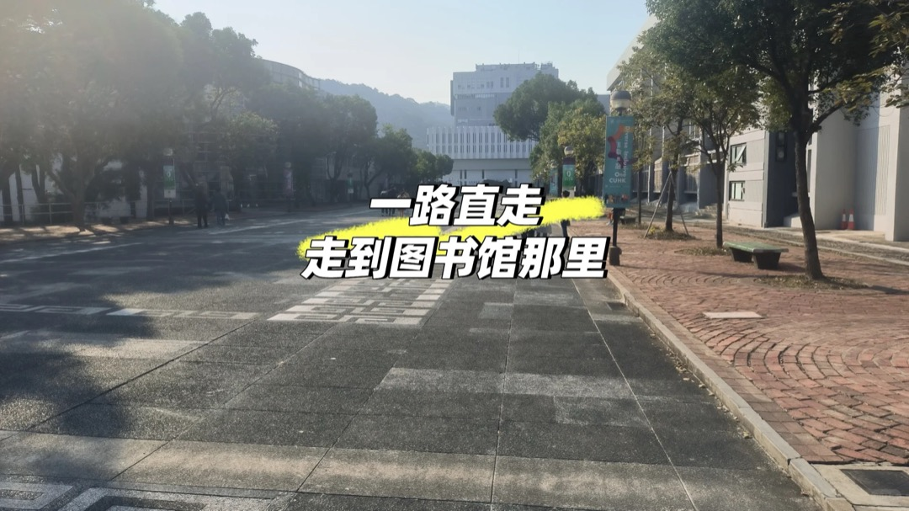
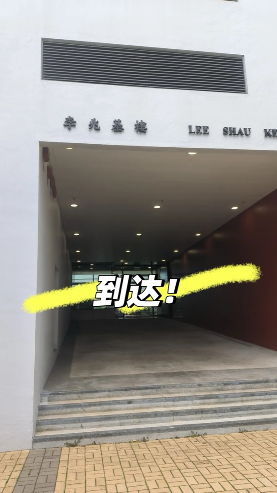

# 李兆基楼（Lee Shau Kee Building, LSK）

## 地点识别

| 名称 | 说明 |
|---|---|
| 李兆基樓 / Lee Shau Kee Building | 官方名，课表缩写 **LSK**，LT5–LT9 多个演讲厅 |
| ⚠️ **别和李兆基建筑学大楼混淆**！ | 校园里还有一栋建筑学相关的"李兆基楼"，看课表建筑缩写 LSK 即本楼（主校园图书馆一侧） |

MScAI 5703（T2 周四晚）在 **LSK LT7** 上课。

## 到达方式总表

| 方案 | 坐什么 | 在哪下 | 步行 | 全程约 |
|---|---|---|---|---|
| **A. 2 号线 → 冯景禧楼站（06.01 优化版，推荐）** | [[../bus/routes-shuttle#2 — NA / UC（新亚/联合）]]（站前广场始发） | Fung King Hey Bldg. 站 | 约 2 分钟 | 7 分钟 |
| B. 1 号线 → 邵逸夫堂站（06 原版） | [[../bus/routes-shuttle#1 — Main（主校园环回）]] | Sir Run Run Shaw Hall 站 | 约 4 分钟（沿百万大道） | 9 分钟 |
| C. 任一线 → 大学行政楼站（不赶时间版） | 几乎每线都停 | Univ. Admin. Bldg. 站 | 约 4–5 分钟 | 10 分钟 |

## 方案 A：2 号线 → 冯景禧楼站（分步）

1. A 口进校园后**向左手边**看，站前广场乘 2 号线。
2. 约 5 分钟后**冯景禧楼站**下车。
3. 下车向**车行反方向**（左手边）前进，路口**右转、再左转**，一路直走即到。
4. 到达：李兆基楼门楼（下图）。

## 方案 B：1 号线 → 邵逸夫堂站（原版）

1. 科学楼/邵逸夫堂站下车（两线同一位置）。看到车窗外大台阶广场（下图）就该准备了。
   
2. 下车直走，在**百万大道右转**。
   
3. 一路直走到**图书馆前**，按图示**下台阶**。
   
4. 沿路直走**过马路**，到达。
   

## 提醒

- ⚠️ 2 号线 :15 发车的班**不停邵逸夫堂**（不影响方案 A 的冯景禧楼站）。
- LSK LT7 在高层；进楼后坐电梯到 LT 所在层（楼层以现场水牌为准）。
- 下课晚归：T2 周四 20:30 下课，校巴 N 线（19:00–23:30）仍在运行，[[../bus/routes-shuttle#N — Night（夜间环回）]]。
