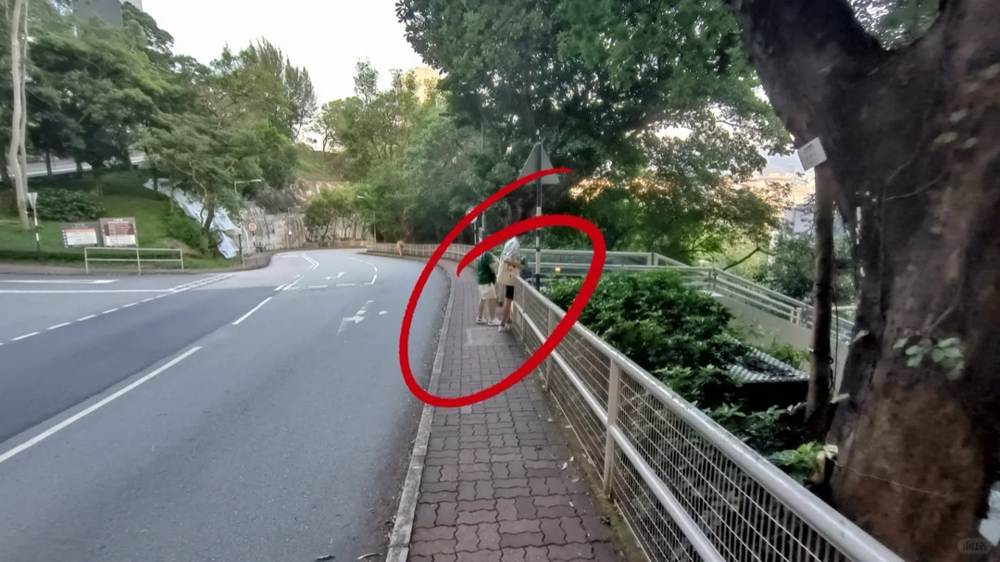
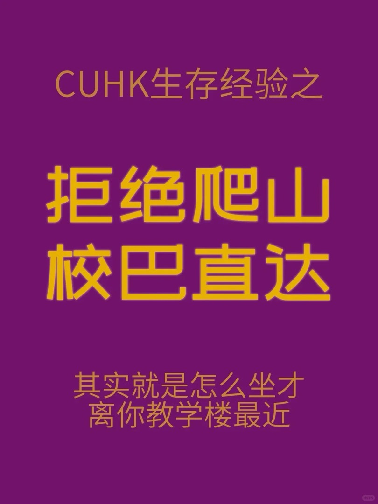
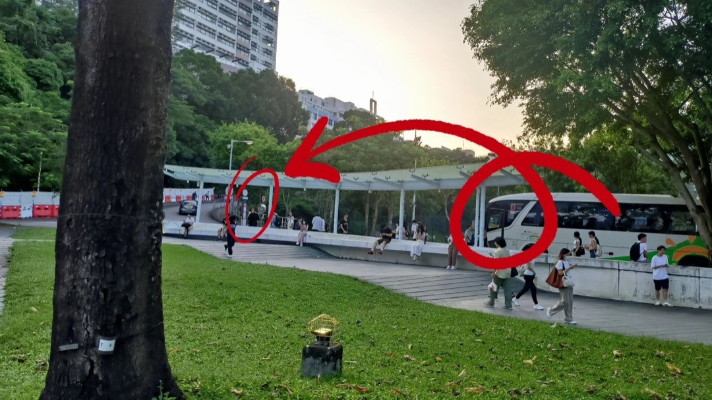

# 蒙民伟工程学大楼（William M.W. Mong Engineering Building, MMW）

## 地点识别

| 名称 | 说明 |
|---|---|
| 蒙民偉工程學大樓 / William M.W. Mong Eng Bldg. | 官方名，课表缩写 **MMW**；快速电梯只停 **G / 4 / 9 楼** |
| ⚠️ **别和"蒙民伟楼"（Mong Man Wai Building）混淆**！ | 校园里另有一栋蒙民伟楼（联合书院一带），一字之差两栋楼。课表写 WMW Mong Eng = 本楼（何善衡工程学大楼旁边） |

MScAI 5740（T2 周三晚）在本楼演讲厅（LT）上课。与何善衡工程学大楼（[[ho-sin-hang-eng-bldg]]）内部连通：本楼 4F 有快速电梯，9F 天桥通何善衡 5F。

## 到达方式总表

| 方案 | 内容 | 用时 |
|---|---|---|
| **A. 2 号线（校巴直达，推荐）** | 站前广场上车 → Univ. Admin. Bldg. 站下 → 步行进 4F | 坐车约 11 分钟 + 步行约 5 分钟 |
| B. 步行（同何善衡步行方案） | A 口 → YIA 扶梯 → 苗圃径 → 本楼电梯入口；全程电梯+平路 | 约 14–16 分钟（到本楼比到何善衡少几分钟） |

方案 B 分步见 [[ho-sin-hang-eng-bldg]] 的步行方案（前 3 步完全相同，第 4 步到达的是本楼）。

## 方案 A：2 号线（分步）

1. A 口出来步行到**站前广场**，在站牌处乘 2 号线（[[../bus/routes-shuttle#2 — NA / UC（新亚/联合）]]）。
   
2. **大学行政楼站**下车——坐左侧，看到下图景色就是该下了。
   
3. 下车沿**车行方向（下山路）**直走，到下图路口**右转**，进门即本楼 **4/F**。
   
4. 4F 坐**快速升降梯**（只停 G/4/9）到 LT 所在层；若课程在何善衡一侧，9F 出门左转过天桥。
   电梯指示牌与面板见 [[ho-sin-hang-eng-bldg]] 方案 C 的配图。

## 提醒

- ⚠️ 快速电梯维修时会拥挤；9 楼天桥是两楼往来主通道。
- T2 周三 21:30 下课：校巴 N 线末班 23:30（[[../bus/routes-shuttle#N — Night（夜间环回）]]），步行下山约 20 分钟也可（苗圃径夜景照明一般，结伴走）。
