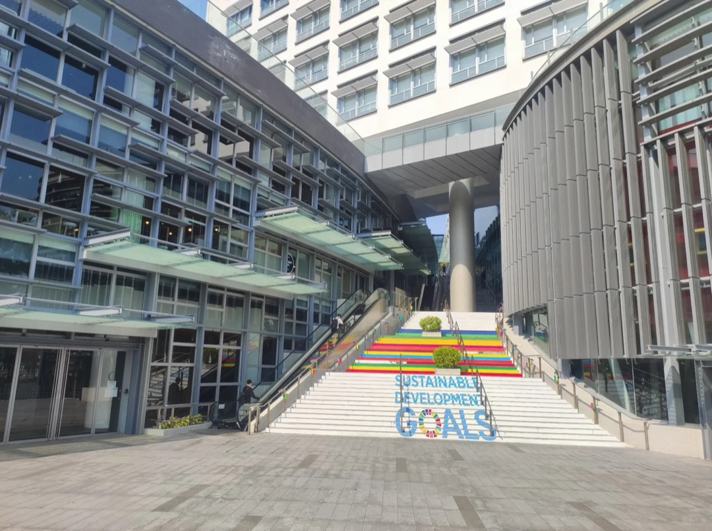
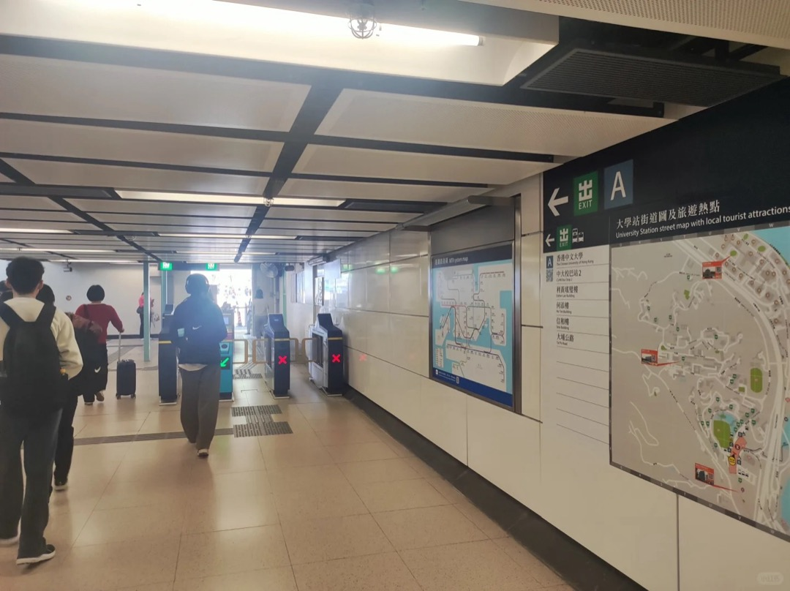
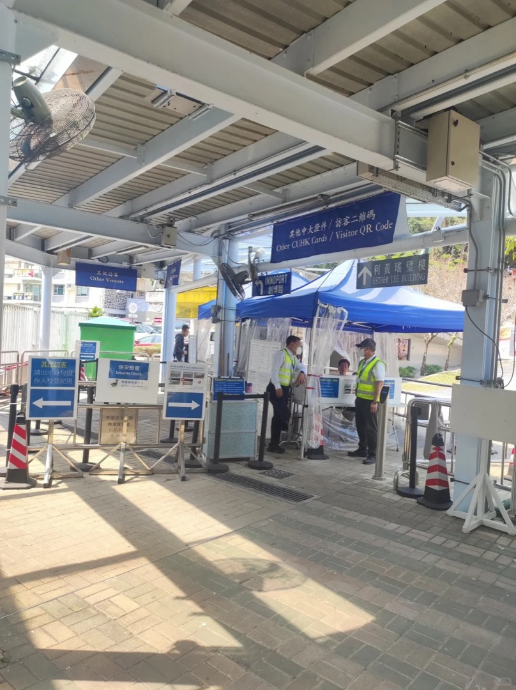

# 康本国际学术园（Yasumoto International Academic Park, Y.I.A.P.）

## 地点识别

| 名称 | 说明 |
|---|---|
| 康本國際學術園 / Yasumoto Int'l Academic Park | 官方名，课表缩写 **Y.I.A.P.**，同学口称"康本园/YIA" |
| LT4 / LT7 | 园内演讲厅（社区笔记称园内有 LT1~LT6 一排，LT4/LT7 的具体楼层**待亲测确认**，进园后按廊道指示牌走） |

位置：大学站旁，**离港铁最近的教学楼**——MScAI 的 5710（T1）和 5704（T2）都在此上课。MScAI 项目办公室所在的何善衡工程楼到达方式见 [[ho-sin-hang-eng-bldg]]（两楼同在大学站一侧，步行可达）。

## 到达方式总表

| 方案 | 内容 | 用时 |
|---|---|---|
| 步行（推荐，唯一常态方式） | 大学站 A 口 → 见分步 | 约 5 分钟 |
| 校巴/小巴 | **康本园本身是多个校巴线的始发站**——坐到这里的场景几乎不存在；下山返程可选 Y.I.A.P. 站上 3/4/8 号线，或 PSLB Down 的 Y.I.A.P. (PSLB) 站 | — |

> 班次详情引用：[[../bus/routes-shuttle#3 — Shaw（逸夫方向）]]、[[../bus/routes-shuttle#4 — Campus（环回下行）]]、[[../bus/routes-pslb]]

## 分步（大学站 → YIA）

1. 大学站 **A 口**出站。持学生证刷卡入校；没有学生证（新生报到初期/访客）用港澳通行证或香港身份证登记。
   
   
2. 入校后**右转一直走**，途中会经过一个校巴站（这就是 1 号线的乘车站，去别的楼才用得上，见 [[../bus/routes-shuttle#1 — Main（主校园环回）]]）。
   
   
3. 看到**彩虹阶梯**，左侧玻璃门进去就是 YIA。进楼后按指示牌找 LT4/LT7。

## 提醒

- ⚠️ YIA 与康本园是同一栋楼的两种叫法；课表写 Y.I.A.P. / Yasumoto 都指这里。
- ⚠️ 从 YIA 去 CTA/中央道一带的教学楼（李兆基楼、鄭裕彤樓等）：出楼右转沿上坡步道走百万大道方向，详见 [[lsk-building]] 与 [[cyt-building]]。
- 实测攻略说园内教室是 LT1~LT6——与课表存在 LT7 矛盾，以现场指示牌为准，第一堂课提前 15 分钟到。
